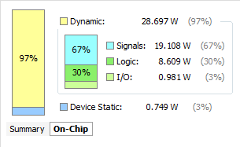

# What did we do?
We have designed and written, in verilog, a MIPS single cycle pseudo multi-core processor utilizing VLIW. Our goal is that our processor can run programs quicker than the standard MIPS single cycle processor. Please our [project abstract](https://github.com/Daniel6/CompArchFA15/blob/master/FinalProject/Project%20Abstract.md "ProjectAbstract.md") for details!

# Why did we do it?

## Open-ended Development
Feel free to build on top of our progress, some interesting areas for further development would be:
* MIPS -> our custom VLIW compiler
* Replace our single-cycle architecture with a [pipelined](https://en.wikipedia.org/wiki/Instruction_pipelining) system
* Expansion of [valid instructions](http://www.mrc.uidaho.edu/mrc/people/jff/digital/MIPSir.html) (currently only supporting J, JR, JAL, BEQ, BNE, ADD, SUB, XORI, LW, SW, SLT)
* Multiple levels of data memory. Currently all cores read/write to one memory, modern CPU's use multiple levels, giving each core its own private memory and mirroring changes to a larger shared memory. You would also want to implement [cache invalidation](https://en.wikipedia.org/wiki/Cache_invalidation) if implementing this architecture.

# Structure
## How do we do it?
We have taken a basic single-cycle CPU and used it as a basis for making a CPU that operates on multiple instructions at a time. The key element to how we have done this was the use of very long instruction words (VLIW) that were composed of four MIPS instructions concatenated together. The CPU splits the VLIW into n words that are then each fed into the core of a single-cycle cpu. Essentially, we have four processing units in one CPU that share the same program counter, registers, instruction memory, and data memory.

For a log of our progress, please take a look at our [diary](https://github.com/Daniel6/CompArchFA15/blob/master/FinalProject/diary.md).

## Block Diagram

## Overall Schematic

# Analysis

## Performance
### What programs run faster
#### String Reversal
Reverse the order of characters in a string of length n stored in memory

- 1-core:                               6 + 9(n/2-1) + 8 cycles
- 2-core:                               3 + 5(n/2) cycles
- 4-core:                               2 + 4(n/2) cycles
- 4-core (w/ multi-core optimization):  3 + 3(n/2) cycles or 4 cycles if string is 1 char or less

Eg: n=8

- 1-core:                              41 cycles (100% speed)
- 2-core:                              23 cycles (178%)
- 4-core:                              18 cycles (228%)
- 4-core (w/ multi-core optimization): 15 cycles (273%)

Eg: n=3

- 1-core:                              14 cycles (100% speed)
- 2-core:                              8 cycles  (175%)
- 4-core:                              6 cycles  (233%)
- 4-core (w/ multi-core optimization): 4 cycles  (350%)

Eg: n=27
- 1-core:                              122 cycles (100% speed)
- 2-core:                              68 cycles  (179%)
- 4-core:                              54 cycles  (226%)
- 4-core (w/ multi-core optimization): 42 cycles  (286%)

#### Division

Compute integer division with a remainder

- 1-core: 7 + 4*(a/b)
- 2-core: 5 + 3*(a/b)
- 4-core: 4 + 3*(a/b)

Eg. a=5, b=2
- 1-core: 15 cycles (100% speed)
- 2-core: 11 cycles (127%)
- 4-core: 10 cycles (133%)

Eg. a=100, b=1
- 1-core: 407 cycles (100% speed)
- 2-core: 305 cycles (125%)
- 4-core: 304 cycles (125%)

Eg. a=0, b=2
- 1-core: 7 cycles (100% speed)
- 2-core: 5 cycles (129%)
- 4-core: 4 cycles (143%)

#### Array Sorting
Use bubble sort to sort the array [14, 12, 13, 5, 9, 11, 3, 7, 10] stored in memory from highest to lowest.

- 1-core: 388 cycles (100% speed)
- 4-core: 297 cycles (131%)

### Multiply
Multiplies two variables in memory.

- 1-Core: 34 Cycles (100% speed)
- 4-Core: 17 Cycles (200% speed)

## Area

In order for our CPU to have higher performance, we had to have the tradeoff of having a larger area than a typical single-cycle MIPS CPU.

We based our area calculations off of the size of fundamental gates, with AND, OR, and XOR being comprised of their negative counterparts and a NOT gate.

### Fundamental gates

| Gate (N inputs each) | Cost per |
| -------------------- | ---      |
| NOT                  | 1        |
| NAND                 | 2N       |
| NOR                  | 2N       |
| XNOR                 | 2N       |
| AND                  | 2N+1     |
| OR                   | 2N+1     |
| XOR                  | 2N+1     |

### Program Counter

The program counter (PC) holds a 32 bit address that signifies the location in the instruction memory of the current instruction. At the positive edge of each clock cycle, the input is propagated through as the new output. We estimate that the program counter requires the following subcomponents.

| Subcomponent | Quantity | Unit Size | Total Size |
|:------------:|:--------:|:---------:|:----------:|
| Positive Edge Triggered DFF  |    32    |     13     |    416     |
|              |          |           |    416    |

### Adder

In order to increment the program counter after each cycle, an adder is used. This adder must be able to handle unsigned 32 bit additions. The table below shows the estimated cost.

| Subcomponent     | Quantity | Unit Size | Total Size |
|:----------------:|:--------:|:---------:|:----------:|
| 1 Bit Full Adder |    32    |    15     |    480     |
|                  |          |           |    480     |

### Instruction Memory

The instruction memory stores program operations. Each instruction requires 32N bits of space, where N is the number of cores in our CPU. Based on the input address supplied, a corresponding instruction will be output at the positive edge of each clock cycle. We estimate the size of this component as follows.

//TODO: Change

| Subcomponent            | Quantity | Unit Size | Total Size |
|:-----------------------:|:--------:|:---------:|:----------:|
| D Flip Flop with Enable |  32,768  |    11     |   360,448  |
| 1024 Option Mux         |  32N     |  34,813   |  1,113,002 |
|                         |          |           |  1,473,450 |

### VLIW Splitter

The VLIW splitter takes the 32N bit instruction and splits it into N different 32 bit instructions, with the Nth instruction being sent to the Nth core. This component only uses wires, no gates.

### Instruction Decoder

The instruction decoder breaks up the 32 bit instruction into its individual parts. This is done simply with wires and requires no gates.

### Sign Extender

The sign extender converts a signed 16 bit immediate into a signed 32 bit number. This is simply done by wiring the most significant bit of the 16 bit number to the top 16 bits of the 32 bit instruction. The rest of the bits are wired to the same location in the new number. This requires no gates.

### Concatenator

The concatenator merges three values into a single 32 bit value. This is simply done by wiring the inputs into the output. This requires no gates.

### Register File

//TODO: Change ports

The register file is similar to the instruction memory. The registers support writing to one of the 32 locations at a time and reading from two different address simultaneously. The estimated size is as follows.

| Subcomponent            | Quantity | Unit Size | Total Size |
|:-----------------------:|:--------:|:---------:|:----------:|
| D Flip Flop with Enable |  1024    |    11     |   11,264   |
| 32 Option Mux           |  64      |  605      |  38,693    |
|                         |          |           |  49,957    |

### Data Memory

The data memory is exactly the same as the instruction memory, except that it holds data values rather than instructions. The sizing is the same.

| Subcomponent            | Quantity | Unit Size | Total Size |
|:-----------------------:|:--------:|:---------:|:----------:|
| D Flip Flop with Enable |  32,768  |    11     |   360,448  |
| 1024 Option Mux         |  32      |  34,813   |  1,113,002 |
|                         |          |           |  1,473,450 |

### ALU

The ALU allows the CPU to compute mathematical operations. This component operates on 32 bit operands. The table below describes its size.

| Subcomponent | Quantity | Unit Size | Total Size |
|:------------:|:--------:|:---------:|:----------:|
| Bit Slice    |  32      |    197    |   6,304     |
| NOT Gate     |  5       |    1      |   5        |
| XNOR Gate    |  2       |    2      |   4        |
| AND Gate     |  11      |    3      |   33       |
| OR Gate      |  1       |    3      |   3        |
| NOR Gate     |  32      |    2      |   64       |
|              |          |           |  6,413      |

### Additional Components

The following components are used within the cpu, outside of any other subcomponent.

| Subcomponent | Quantity | Unit Size | Total Size |
|:------------:|:--------:|:---------:|:----------:|
| AND Gate     |  11      |    3      |   33       |
| OR Gate      |  1       |    3      |   3        |
|              |          |           |  36        |

#### Total

The grand total size is calculated in the following table.

| Subcomponent       | Quantity | Unit Size    | Total Size  |
|:------------------:|:--------:|:------------:|:-----------:|
| Adder              |  1       |    480       |   480       |
| Program Counter    |  1       |    288       |   288       |
| Instruction Memory |  1       |   1,473,450  |   1,473,450 |
| Registers          |  1       |    49,957    |   49,957    |
| Data Memory        |  1       |    1,473,450 |   1,473,450 |
| ALU                |  1       |    6,413     |   6,413     |
| AND Gate           |  11      |    3         |   33        |
| OR Gate            |  1       |    3         |   3         |
|                    |          |              |   3,004,074 |

## Area and Energy Synthesis

We used Vivado to synthesize area and energy analysis. However, we were only able to synthesize analysis on the one core version of our CPU, and not a four core model, because Vivado would not allow us to have multiple modules writing to RAM.

As a result, we assumed that we can multiply parts of the energy and area analysis by four to come up with a rough estimate of what our four core CPU would cost; our four core CPU has all of the same components as our one core CPU, but with some components replicated four times and others having more inputs/outputs. Below are images displaying the synthesis for our one core CPU.

#### Cost Synthesis

#### Power Breakdown

For four cores, we multiplied signals and logic by four to find our energy cost. We chose to multiply signals and logic by four because most of these parts are found in our core, of which our four core CPU has four.

#### Four Core Power Breakdown
| Dynamic      | Amount (W) |
|:------------:|:----------:|
| Signals      | 76.432     |
| Logic        | 34.436     |
| I/O          | .981       |
| Total Dynamic| 111.849    |
| **Static**   | .749       |
| **Total**    | 112.598    |

#### Four Core Area

# Testing Strategy
Our testing strategy was centered around using unit tests at the component, instruction, and program level. For our unit tests at the component level, we had tests to confirm that each one perform what we want. At the instruction level, the tests were focused on making sure that our cpu outputs conform to the MIPS guidelines. Finally, at the program level, we ran programs using our CPU, and compared the register results against what we want/expect.
## Unit Tests
Each component used in our CPU was tested to verify that they worked as planned. The list of components tested are listed below:

* controlTable
* core
* datamemory
* instructiondecoder
* instructionmemory
* pcjumper
* registerfile
* vliwsplitter

These components will form the backbone of our CPU.

## CPU Instruction Tests

The CPU was tested to perform a set of individual MIPS ISA instructions properly. The list of operations that the CPU can perform are as follows:

* LW
* SW
* J
* JR
* JAL
* BNE
* BEQ
* XORI
* ADD
* SUB
* SLT

For each of these instructions, the CPU performed the desired operation on all four cores in parallel. After each of these fundamental operations executed properly, larger programs could be built using many instructions simultaneously.

## Analysis Testings
