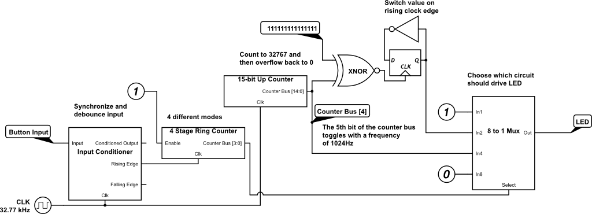

##Midterm Writeup
Daniel Bishop

###Table of Contents
1. [Specifications](#specifications)
  1. [I/O](#io)
  2. [Operational Modes](#operational-modes)
    1. [FSM](#finite-state-machine)
  3. [Dimensions](#dimensions)
2. [Block Diagram](#block-diagram)
3. [Schematic](#schematic)
  1. [Top Level](#total-circuit)
  2. [Up Counter](#up-counter)
  3. [Input Conditioner](#input-conditioner)
  4. [Shifter](#shifter)
4. [Cost Breakdown](#cost-breakdown)

###Specifications

####I/O
User provides input via one push-button.  
System provides output to one LED whose state can either be ON or OFF.

####Operational Modes
1. ON: LED is powered
2. OFF: LED is unpowered
3. BLINKING: LED switches between ON and OFF states every second (1Hz frequency)
4. DIM: LED switches between ON and OFF states rapidly (2048Hz frequency).  

#####Finite State Machine  
  

####Dimensions
<TODO>

###Block Diagram

###Schematic  

####Total Circuit  

This circuit uses an input conditioner to debounce the physical button input. On the rising edge of the button signal (when the button is pressed down), a 4-stage ring-counter increments by 1. The output of this ring-counter is the current mode of the LED, using a one-hot encoding. This 4-bit value is passed on to an 8-to-1 multiplexer which passes the corresponding driver signal to the LED. The multiplexer is an 8-to-1 instead of a 4-to-1 because of the one-hot encoding of the mode, where the 4 modes correspond to values of 1 (0b0001), 2 (0b0010), 4 (0b0100), and 8 (0b1000). The ON and OFF driver circuits are fairly self-explanatory, they hold values at 1 and 0 respectively. The BLINKING driver circuit uses an up-counter to toggle the state of the LED every 32768 clock cycles (1Hz). The DIM driver circuit hooks into the same up-counter as the BLINKING circuit, but only reads the 5th bit of the counter. This bit toggles with a frequency of 2048Hz (SysClock / 2^(n-1)), and with a duty cycle of 50%, leads to an LED with 50% perceived intensity.

####Up Counter

This up counter takes no inputs and uses 15 D flip-flops to count by 1 every clock cycle, overflowing at 0b111111111111111.
Made with reference to [learnabout-electronics.org](http://www.learnabout-electronics.org/Digitcal/dig56.php)

####Input Conditioner  

The input conditioner synchronizes a noisy input signal (coming from the button) and debounces it with a wait time of 127 clock cycles (3.88 milliseconds) using an up-counter. The input conditioner outputs a filtered input signal, as well as signals for detecting rising and falling edges in the filtered signal.

####Shifter  

This component takes a 4-bit number and shifts the bits to the left by one place. The Least Significant Bit is filled with a 0.

###Cost Breakdown
